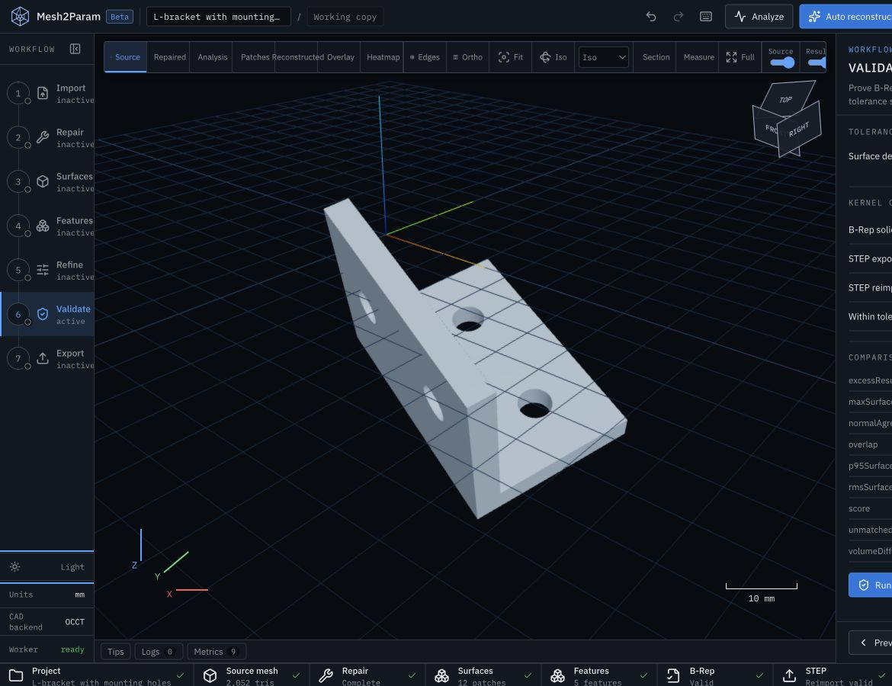
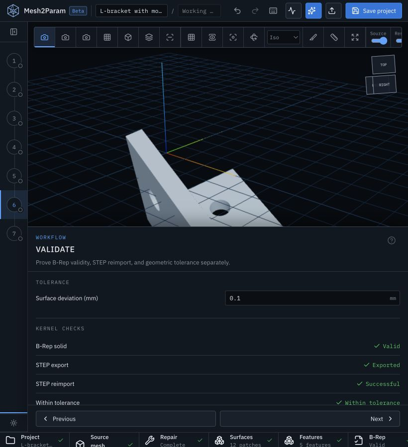
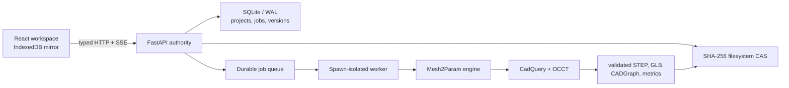

# Mesh2Param

Mesh2Param converts supported STL, OBJ, and PLY triangle meshes into an editable, versioned
CADGraph, an exact Open CASCADE B-Rep, a STEP file that has been reimported and validated through
the kernel, deterministic browser artifacts, and source-versus-result metrics.

> **Mesh2Param reconstructs an editable, geometrically equivalent CAD model. It does not guarantee recovery of the source designer's exact original feature history.**

The automatic reconstruction claim is deliberately bounded. The shipped end-to-end inference path
supports the deterministic, transform-blind, sharp-edged L-bracket sample with four complete
through-hole cylinders. Other models still receive truthful ingestion diagnostics, explicit repair,
analytic segmentation, manual CADGraph operations, validation tools, and artifacts; unsupported
automatic histories fail or remain partial instead of being invented.

## Workspace



The same seven-step engineering workflow adapts to a compact viewport without replacing the real
3D viewer or validation evidence with a simplified mock:



## What is supported

| Area | Current support |
| --- | --- |
| Input | Binary/ASCII STL, OBJ, PLY; explicit units and scale; preserved original bytes and SHA-256 |
| Exact modeling | Extrusion, pocket, through/blind hole, counterbore, countersink, revolution, linear/circular pattern, mirror, chamfer, fillet, imported faceted fallback |
| Automatic inference | Bounded L-profile extrusion plus four evidence-backed through holes from plane/full-cylinder evidence |
| Analysis | Mesh health, explicit repair history, deterministic plane/cylinder patches, frame alternatives, residuals, source/result metrics |
| Validation | CADGraph schema/invariants, feature-by-feature OCCT compilation, B-Rep checks, STEP export, STEP reimport, solid validation, tolerance comparison |
| Workspace | Seven-step React UI, real Three.js artifacts, patch selection, feature editing, candidate histories, unified undo/redo, IndexedDB recovery, project save/open |
| Browser-local Worker mode | IndexedDB project/version/artifact authority, local jobs, bundled samples, OCCT WebAssembly CADGraph rebuild, STEP export/reimport validation |
| Server mode | FastAPI, SQLite/WAL, immutable filesystem CAS, durable jobs/SSE, process isolation, cancellation, versions, manifests |

Not automatically inferred today: general prismatic parts, arbitrary hole counts, partial cylinders,
freeform/organic surfaces, fillets/chamfers/patterns/mirrors, compound holes, damaged profile loops,
or the source author's original constraint strategy. See [fallbacks and limitations](docs/fallbacks.md).

## Architecture



Mesh2Param has two execution profiles. The Cloudflare profile is browser-authoritative: IndexedDB
stores projects, revisions, jobs, versions, sources, and artifacts, while a dedicated Web Worker
runs OCCT WebAssembly. The self-hosted profile keeps FastAPI as the authority and uses native
CadQuery/OCCT workers. CADGraph—not generated Python—is the executable geometry model in both.
See [architecture](docs/architecture.md) and [CADGraph](docs/cadgraph.md).

## Prerequisites

- Python 3.12 (the current dependency set is intentionally constrained to `<3.13`)
- Node.js 20 or newer
- pnpm 10 or newer (the repository pins pnpm 11.7.0)
- [uv](https://docs.astral.sh/uv/)
- Optional for production-container verification: Docker with Compose v2

No login, paid API, cloud account, or runtime CDN is required for local use.

## Quickstart

```sh
pnpm install --frozen-lockfile
XDG_CACHE_HOME=.cache uv sync --extra dev
pnpm db:migrate
pnpm dev
```

Open `http://127.0.0.1:5173`. The API is `http://127.0.0.1:8000`; liveness, readiness,
the self-hosted endpoint index, and OpenAPI are `/health`, `/ready`, `/docs`, and `/openapi.json`.
The default development profile starts the API and its embedded local geometry supervisor together.

### Sample workflow

1. Choose **Load sample** and open **L-bracket with mounting holes**.
2. Confirm millimetres in Import; inspect the preserved source hash and mesh diagnostics.
3. Run Repair and Surfaces; select a cylindrical patch and review its fit evidence.
4. Run Auto reconstruct; inspect candidate scores and choose a kernel-valid history.
5. Edit a hole diameter in Refine, rebuild, then run Validate.
6. Confirm B-Rep validity and STEP reimport independently; inspect tolerance metrics.
7. Download `model.step`, `model.cadgraph.json`, or the export bundle; save the project file and
   reload to verify recovery.

Only a completed validation job may present a STEP artifact as reimport-valid.

## Root commands

| Command | Purpose |
| --- | --- |
| `pnpm dev` | Start Vite, FastAPI, and the embedded local geometry supervisor |
| `pnpm build` | Build contracts, UI/web production assets, and Python distributions |
| `pnpm typecheck` | TypeScript strict checks plus mypy |
| `pnpm lint` | Generated-contract drift, ESLint, and Ruff |
| `pnpm test` | Contract, web, engine, API, security, and geometry tests |
| `pnpm test:e2e` | Playwright primary workflow (requires installed browser binaries) |
| `pnpm cf:test` | Browser-local Cloudflare/OCCT WebAssembly integration test (run `pnpm cf:dev` first) |
| `pnpm verify` | Full local delivery gate, including deterministic samples and browser acceptance |
| `pnpm db:migrate` | Apply SQLite schema migrations |
| `pnpm samples:generate` | Regenerate the seeded procedural corpus |
| `pnpm mesh2param -- --help` | Show the shared engine CLI |
| `uv run --extra dev python scripts/check_licenses.py` | Audit installed Python/pnpm licenses and notices |

## CLI

The CLI and API workers call the same engine functions:

```sh
pnpm mesh2param -- analyze source.stl --units mm --output artifacts/
pnpm mesh2param -- repair source.stl --units mm --output artifacts/
pnpm mesh2param -- segment source.stl --units mm --output artifacts/
pnpm mesh2param -- reconstruct source.stl --units mm --output artifacts/
pnpm mesh2param -- rebuild model.cadgraph.json --output artifacts/
pnpm mesh2param -- compare source.stl model.step --units mm --output artifacts/
pnpm mesh2param -- validate model.step --units mm --output artifacts/
pnpm mesh2param -- samples generate --sample l-bracket-with-holes
pnpm mesh2param -- serve
```

## Docker and production operations

The production topology is a same-origin web proxy, one API process, and one external geometry
worker sharing the absolute data volume. Start it with:

```sh
cp .env.example .env
docker compose config
docker compose up --build
```

The copied `.env` is a Compose interpolation profile. Mesh2Param itself reads explicit process
environment variables and does not auto-load dotenv files, so `pnpm dev` continues to use its safe
embedded local-worker defaults after a container run.

Production uses `MESH2PARAM_JOB_RUNNER_MODE=external` and exactly one SQLite worker. The API
`/health` endpoint is process liveness; `/ready` also requires database/storage access and a fresh
worker heartbeat. Do not expose the no-login profile to an untrusted network; terminate TLS at a
trusted reverse proxy and configure exact hosts/origins. See [deployment](docs/deployment.md).

### Cloudflare Worker frontend

The React application can also be deployed as a Cloudflare Worker with Workers Static Assets:

```sh
pnpm cf:check
pnpm cf:deploy
```

The default Worker deployment is self-contained: Cloudflare serves the SPA, sample corpus, and
22 MB OCCT WebAssembly asset; projects and artifacts live in the browser's IndexedDB and geometry
runs in a dedicated browser worker. No Python API is required for bundled samples or exact CADGraph
rebuild/validation/export. Arbitrary-mesh automatic inference is still a native-server capability;
browser-local mode reports that boundary instead of inventing geometry. The edge proxy remains
available for explicit legacy/server integrations through `MESH2PARAM_API_ORIGIN`. See
[Cloudflare Worker deployment](docs/deployment.md#cloudflare-worker-frontend).

## Project files and artifacts

`project.mesh2param.json` is a schema-versioned working-project interchange file. It contains project
metadata, CADGraph, repair/analysis state, versions, validation and artifact descriptors, and
restore-relevant UI state. A source mesh is embedded only when policy and size allow; otherwise the
file carries a hash-bound local reference and must not imply portability. Imports validate the
extension, schema, bounds, source byte count, and SHA-256 before hydration. See
[project-file format](docs/project-file.md).

A complete conversion can produce:

```text
model.step                model.cadgraph.json       model.cq.py
source.glb                repaired.glb              analysis-proxy.glb
patches.glb               reconstructed.glb         residual.glb
analysis.json             metrics.json              manifest.json
project.mesh2param.json   mesh2param-export.zip
```

Artifact sets are immutable and content-addressed. `manifest.json` binds project/version/source
identity, units, settings, validation, dependency versions, artifact sizes, and SHA-256 hashes.

## API and security

Project mutations require `If-Match: "rev-N"`; stale writes fail rather than overwrite. Geometry
operations return durable jobs, stream real phase events over replayable SSE, and support
cancellation. See the [API reference](docs/api.md).

Uploads and generated geometry are untrusted. Mesh2Param uses structural parser allowlists, bounded
streams and allocation limits, randomized private staging, no-follow content-addressed storage,
static worker dispatch, process/resource isolation, egress denial in production, strict origins and
hosts, and no uploaded/generated script execution. See [security model](docs/security.md) and
[vulnerability reporting](SECURITY.md).

## Validation methodology

Validation is a chain, not a UI label:

```text
CADGraph validation → deterministic OCCT build → BRepCheck → STEP export
→ independent STEP reimport → solid/BRepCheck → tessellation → source comparison
```

The project persists each stage and its failure state. A close mesh does not rescue an invalid
B-Rep, and a valid B-Rep does not claim tolerance success without comparison evidence. See
[validation](docs/validation.md).

## Troubleshooting

- **`node` or `pnpm` is too old:** use Node 20+ and reinstall with the pinned pnpm version.
- **Python resolves outside 3.12:** run through `uv`; the system Python is not the project runtime.
- **`/ready` is not ready:** check database/storage permissions and worker heartbeat; `/health`
  alone does not prove geometry capacity.
- **A reconstruction is unsupported:** keep the diagnostics/patches, use manual features or the
  explicit **Faceted STEP fallback**. The fallback preserves the upload, records its OCCT sewing
  tolerance in project units, labels the result non-parametric, and still requires a solid-valid
  STEP reimport. Its viewport layer is a preserved-mesh proxy; it does not claim a measured
  source-to-B-Rep deviation.
- **Playwright cannot launch in a managed sandbox:** run `pnpm test:e2e` on a normal host/CI runner;
  the limitation and exact observed error are in [fallbacks](docs/fallbacks.md).
- **License inventory is stale:** install both lockfiles, then run the checker with
  `--write-notices` and rerun it without mutation.

## Documentation

- [Architecture](docs/architecture.md)
- [CADGraph](docs/cadgraph.md)
- [Project-file format](docs/project-file.md)
- [Validation](docs/validation.md)
- [Security](docs/security.md)
- [Deployment](docs/deployment.md)
- [Fallbacks and limitations](docs/fallbacks.md)
- [Contributing](CONTRIBUTING.md)

## Licensing

Mesh2Param original source is Apache-2.0; see [LICENSE](LICENSE) and [NOTICE](NOTICE). Native OCCT
libraries remain LGPL-2.1 with the Open CASCADE exception, and the transitive CasADi dependency is
LGPL-3.0-or-later. Their canonical texts, source references, override rationale, and the complete
installed dependency inventory are in [THIRD_PARTY_NOTICES.md](THIRD_PARTY_NOTICES.md) and
[`licenses/`](licenses/README.md).
