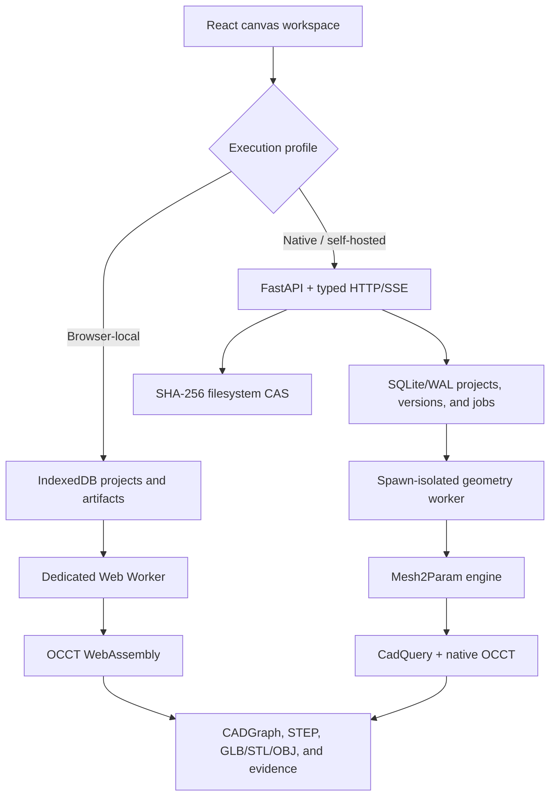

# Mesh2Param

Mesh2Param is an evidence-first mesh-to-CAD reconstruction workspace. It preserves an uploaded
STL, OBJ, or PLY mesh, analyzes its geometry, and follows one of three honest conversion paths:
an editable parametric CADGraph, a tolerance-controlled curved B-Rep, or a source-bound faceted
STEP fallback. Every claimed STEP solid is exported through Open CASCADE, independently
reimported, and checked again before the UI presents it as valid.

> Mesh reconstruction is an inverse problem. Mesh2Param can recover supported geometry and build a
> new editable model, but it cannot guarantee the source designer's original sketches, constraints,
> dimensions, or feature order.

Mesh2Param is beta software. Unsupported or ambiguous geometry fails with diagnostics; it is not
silently replaced by a plausible-looking model.

## Current conversion paths

| Path | Result | Current supported scope | Validation meaning |
| --- | --- | --- | --- |
| Parametric inference | Editable CADGraph and analytic OCCT B-Rep | Straight extrusions with matched planar caps and closed line/arc/circle profiles, including profile holes; bounded spline-profile spanners may also recover a regular-polygon cut, constant-radius rim fillets, and qualifying shallow cap details | Kernel-valid, STEP-reimport-valid, and compared with the source mesh; functional detail suppression is the default, while full additive-detail recovery is opt-in |
| Native curved reconstruction | Approximate B-spline/analytic surface-network B-Rep | Bounded plate-like STL topology with one or two freeform top regions, sharp or user-declared smooth joins, recognized cylindrical holes, and supported spherical, conical, or toroidal protrusions | Measured source deviation, continuity evidence, B-Rep checks, STEP round trip, surface inventory, and structural STEP audit |
| Browser-local curved reconstruction | Approximate swept or smooth-loft B-Rep in OCCT WebAssembly | One valid, consistently wound, watertight, axis-aligned layered STL within browser budgets | Solid and STEP-reimport checks, curved-face inventory, volume gate, and bounds-delta gate |
| Faceted fallback | Non-parametric STEP with one planar face per preserved triangle | Source-bound STL with unchanged project units and scale factor `1` | B-Rep and STEP reimport are proven; geometric tolerance remains unmeasured, so validation is intentionally partial |
| CADGraph rebuild | Deterministic exact B-Rep for the supplied parameters | Trusted CADGraph documents and their hash-bound artifacts | Feature-by-feature compilation, kernel validation, STEP export, and STEP reimport |

“Exact” describes the B-Rep produced from a CADGraph's explicit parameters. It does not mean that
an inferred model is the unique or original interpretation of a triangle mesh. “Approximate
curved” means genuine analytic or B-spline STEP surfaces fitted to mesh evidence within reported
tolerances—not visually smoothed triangles.

The CADGraph compiler currently supports extrusion, pocket, hole, counterbore, countersink,
revolution, linear and circular patterns, mirror, chamfer, fillet, imported faceted bodies, and
content-addressed reconstructed surface networks.

### Known boundaries

- General arbitrary-topology STL-to-parametric-CAD recovery is not implemented.
- OBJ and PLY are supported for ingestion and analysis; the source-bound curved and faceted
  conversion modes currently require STL.
- Freeform curved reconstruction is intentionally limited to qualified plate-like topologies. Open,
  non-manifold, self-intersecting, detached, over-budget, or unsupported analytic/freeform joins
  fail closed.
- Curvature-space sub-segmentation for fillet-band evidence exists behind an opt-in setting and is
  disabled by default. It currently refines analysis evidence only; it is not yet routed into
  reconstruction or STEP generation.
- The faceted fallback proves that OCCT produced and reimported a solid. It does not claim recovered
  features, curved faces, or a measured source-to-result deviation.

See [fallbacks and limitations](docs/fallbacks.md) and the
[curved reconstruction implementation record](docs/curved-step-reconstruction.md) for the detailed
failure boundaries and acceptance gates.

## Workspace

The current web app uses a canvas-first workflow:

1. Open an STL, OBJ, PLY, saved `.mesh2param.json` project, or bundled sample.
2. Confirm project units and scale, then analyze mesh health and surface evidence.
3. Inspect patches in the real 3D viewport. Patch controls can lock, hide, reclassify, merge, or
   override a detected crease where the server can prove the requested edit.
4. Follow the guided conversion action. Supported geometry uses parametric reconstruction;
   otherwise the app offers approximate curved STEP first and a clearly labeled faceted fallback.
5. Inspect the ordered feature tree and detail diagnostics. Compare Source, Result, overlay, and
   residual/suppressed views, use movable section planes and distance/angle/radius measurements,
   then download STEP, GLB, STL, or OBJ or save the working project.

Projects, versions, jobs, display preferences, and artifact descriptors survive reloads. Browser
mode uses IndexedDB as its local authority; server mode mirrors the workspace while enforcing
revision preconditions. A saved project preserves metadata and manifests, but stale artifact URLs
are never treated as live geometry after import.

## Architecture



CADGraph—not generated Python—is the authoritative executable geometry model. Generated CadQuery
source is an inspectable export and is never executed from an upload. Read
[architecture](docs/architecture.md), [CADGraph](docs/cadgraph.md), and the
[API reference](docs/api.md) for the deeper contracts.

## Prerequisites

- Python `>=3.12,<3.13`
- Node.js 20 or newer
- pnpm 10 or newer; the repository pins pnpm `11.7.0`
- [uv](https://docs.astral.sh/uv/)
- Optional: Docker with Compose v2 for the production topology
- Optional: Playwright browser binaries for end-to-end tests

No login, paid conversion API, runtime CDN, or cloud account is required for local development.

## Quickstart

From the repository root:

```sh
pnpm install --frozen-lockfile
XDG_CACHE_HOME=.cache uv sync --extra dev
pnpm db:migrate
pnpm dev
```

Open `http://127.0.0.1:5173`. The native API runs at `http://127.0.0.1:8000`.

Useful readiness endpoints:

```text
http://127.0.0.1:8000/health       process liveness
http://127.0.0.1:8000/ready        database, storage, and geometry-supervisor readiness
http://127.0.0.1:8000/docs         self-hosted API endpoint index
http://127.0.0.1:8000/openapi.json OpenAPI document
```

`pnpm dev` starts Vite and the FastAPI service together. Development defaults to the embedded local
geometry supervisor and stores data under `.mesh2param-data/`.

### Try a reference project

Choose **Try the L-bracket sample** on the landing screen, then use the Source, Result, and Compare
display modes to inspect its validated reference artifacts. The generated sample corpus is ground
truth produced from trusted CADGraphs; it demonstrates the workspace and compiler, not a claim that
every sample's original feature tree can be inferred from its STL.

## Command line

The CLI uses the same ingestion, reconstruction, compiler, comparison, and validation modules as
the native API:

```sh
pnpm mesh2param -- analyze source.stl --units mm --output artifacts/
pnpm mesh2param -- repair source.stl --units mm --output artifacts/
pnpm mesh2param -- segment source.stl --units mm --output artifacts/
pnpm mesh2param -- reconstruct source.stl --units mm --output artifacts/
pnpm mesh2param -- rebuild model.cadgraph.json --output artifacts/
pnpm mesh2param -- compare source.stl model.step --units mm --output artifacts/
pnpm mesh2param -- validate model.step --units mm --output artifacts/
pnpm mesh2param -- samples list
pnpm mesh2param -- samples generate --sample l-bracket-with-holes
pnpm mesh2param -- serve
```

The `reconstruct` CLI runs bounded parametric inference. Approximate curved and faceted modes are
currently exposed through the web workspace and `POST /api/projects/{id}/reconstruct`:

```json
{"settings":{"detailMode":"full"}}
```

`detailMode: "full"` is an opt-in native-service setting that converts qualifying bounded shallow
cap loops into additive extrusion features. Omitting it preserves the default functional mode,
which declares and masks qualifying details without changing the preserved source mesh.

```json
{"settings":{"mode":"curved","fitTolerance":0.25,"surfaceDeviationTolerance":0.3,"forceSplit":false}}
```

```json
{"settings":{"mode":"faceted","sewingTolerance":0.05}}
```

Tolerances are expressed in project units and are physically capped. These source-bound modes also
require unchanged units and a source scale factor of `1`; normalize a working copy explicitly
instead of silently changing units.

## Development commands

| Command | Purpose |
| --- | --- |
| `pnpm dev` | Start the native API/embedded geometry supervisor and Vite app |
| `pnpm build` | Build contracts, shared UI, the production web app, and Python distributions |
| `pnpm typecheck` | Run strict TypeScript checks and mypy |
| `pnpm lint` | Check generated-contract drift, ESLint, and Ruff |
| `pnpm test:frontend` | Run contract, shared-UI, and web unit tests |
| `pnpm test:api` | Run the API-focused Python tests |
| `pnpm test:backend` | Run the complete Python test suite |
| `pnpm test:geometry` | Run the exact sixteen-step geometry acceptance case |
| `pnpm test:e2e` | Run the native primary-workflow Playwright test |
| `pnpm cf:test` | Run browser-local Cloudflare/OCCT integration tests against `pnpm cf:dev` |
| `pnpm samples:check` | Verify the committed procedural corpus in the pinned image (Docker required) |
| `pnpm curved:fixtures` | Regenerate the curved ground-truth benchmark fixtures |
| `pnpm curved:baseline` | Measure the faceted baseline for the curved corpus |
| `pnpm general:fixtures` | Regenerate the general-parametric spanner fixtures |
| `pnpm acceptance` | Run the scripted acceptance report |
| `pnpm licenses:check` | Verify dependency license policy and notices |
| `pnpm verify` | Run the full delivery gate, including tests, samples, build, browser acceptance, and licenses |

`pnpm samples:check` keeps every non-STEP artifact byte-exact. A changed STEP
serialization is accepted only when both manifests and metadata remain
self-consistent, the semantic sample record is unchanged, both files pass live
OCCT validation and reimport, topology and surface classes match, and a
scale-aware symmetric-difference check proves the solids geometrically
equivalent. Accepted serialization drift is reported explicitly.

Generated contracts begin in `packages/contracts/schema/cadgraph.schema.json`. Do not hand-edit a
generated TypeScript or Python contract without updating the schema and generator inputs.

## Validation and artifacts

Validation is a chain, not a UI label:

```text
CADGraph/schema checks -> deterministic OCCT build -> BRepCheck -> STEP export
-> independent STEP reimport -> solid/topology/surface checks -> source comparison
```

A close mesh does not rescue an invalid B-Rep, and a valid B-Rep does not imply that geometric
tolerance passed without comparison evidence. Curved runs additionally retain fit residuals,
surface types, UV/continuity evidence, shared-edge checks, deterministic artifact hashes, and a
pure-Python structural audit of the STEP Part 21 file. See [validation](docs/validation.md).

Depending on the conversion path, an artifact set can include:

```text
model.cadgraph.json       model.cq.py              model.step
source.glb                repaired.glb             analysis-proxy.glb
patches.glb               reconstructed.glb        reconstructed.stl
reconstructed.obj         residual.glb
analysis.json             metrics.json             validation.json
suppressed-regions.json   detail-regions.json      candidates.json
curved-plate.json         manifest.json            mesh2param-export.zip
project.mesh2param.json
```

Artifact sets are immutable and content-addressed. Manifests bind project, version, source hash,
units, settings, dependency versions, validation evidence, byte sizes, and SHA-256 hashes.

## Saved project files

`project.mesh2param.json` is the versioned working-project interchange format. It can contain
project metadata, source descriptors or bounded embedded source bytes, CADGraph, analysis and
repair state, versions, validation, artifact descriptors, and restore-relevant UI state. Imports
validate the extension, schema, source size, bounds, and SHA-256 before hydration. See the
[project-file specification](docs/project-file.md).

## Deployment

CI runner scope, activation gates, measurements and rollback are documented in
[trusted-main CI migration](docs/trusted-vps-ci.md).

### Docker Compose

```sh
cp .env.example .env
docker compose config
docker compose up --build
```

The production topology is a same-origin Nginx web proxy, one FastAPI process, and exactly one
external geometry worker sharing an absolute data volume. The worker runs without network access.
The default web address is `http://127.0.0.1:8080`.

The application reads explicit `MESH2PARAM_*` process variables; it does not auto-load dotenv
files. `.env` is a Docker Compose interpolation profile only. Review
[deployment](docs/deployment.md) before changing hosts, origins, resource bounds, or persistence.

### Cloudflare Worker frontend

```sh
pnpm cf:check
pnpm cf:deploy
```

Cloudflare serves the built SPA and OCCT WebAssembly as Workers Static Assets. With
`MESH2PARAM_API_ORIGIN` empty, bundled samples, local projects, CADGraph rebuilds, and the bounded
browser conversion path remain self-contained in the browser. That path now reconstructs the
general-parametric spanner family as an editable line/arc/B-spline extrusion, regular-polygon cut,
paired rim fillet, and optional shallow rectangular boss; it exports and reimports STEP in
OCCT-WASM without uploading the source. See
[browser-local parametric reconstruction](docs/browser-local-parametric.md) for its exact scope and
acceptance gates. Set `MESH2PARAM_API_ORIGIN` to the
public HTTPS origin of a separately hosted FastAPI/native-OCCT service to proxy `/api`, `/health`,
`/ready`, `/docs`, and `/openapi.json` for native reconstruction.

For a browser-local Worker deployment, monitor `GET /health`: it returns `200` with
`executionMode: "browser-local"` when the deployed static application is serving correctly. `GET
/ready` is intentionally reserved for the optional native API and returns `503` until
`MESH2PARAM_API_ORIGIN` is configured. When that origin is configured, both routes proxy the native
service; use `/ready` to check its database, storage, and geometry-worker capacity. See
[deployment](docs/deployment.md#cloudflare-worker-frontend) for the full production and self-hosting
configuration.

## Security model

Uploads and generated geometry are untrusted. Mesh2Param uses bounded stream parsing, structural
allowlists, randomized private staging, no-follow content-addressed storage, explicit job and
geometry budgets, a static trusted worker-operation map, process isolation, and production egress
denial. Project mutations use `If-Match: "rev-N"`; stale writes fail instead of overwriting newer
state.

There is currently no authentication layer. Do not expose the native service directly to an
untrusted network; terminate TLS at a trusted reverse proxy and configure exact hosts and origins.
Read the [security model](docs/security.md) and [vulnerability reporting policy](SECURITY.md).

## Repository map

```text
apps/web/             React, Three.js, IndexedDB, and browser-local OCCT workspace
cloudflare/           Worker proxy and static-assets entry point
engine/mesh2param/    Ingestion, segmentation, inference, B-Rep compilation, and validation
packages/contracts/   CADGraph schema plus generated Python and TypeScript contracts
packages/ui/          Shared UI primitives and design tokens
services/api/         FastAPI, SQLite repository, CAS storage, jobs, and worker supervision
samples/              Deterministic parametric and curved reconstruction fixtures
scripts/              Corpus generation, baselines, acceptance, security, and license tooling
tests/                Engine, API, infrastructure, and browser coverage
docs/                 Architecture, formats, deployment, security, research, and design notes
```

## Documentation

- [Architecture](docs/architecture.md)
- [API](docs/api.md)
- [CADGraph](docs/cadgraph.md)
- [Validation](docs/validation.md)
- [Project-file format](docs/project-file.md)
- [Curved STEP reconstruction](docs/curved-step-reconstruction.md)
- [General parametric reconstruction plan](docs/general-parametric-reconstruction.md)
- [Freeform reconstruction research](docs/freeform-step-reconstruction.md)
- [Fallbacks and limitations](docs/fallbacks.md)
- [Deployment](docs/deployment.md)
- [Security](docs/security.md)
- [Sample corpora](samples/README.md)
- [Contributing](CONTRIBUTING.md)

## Licensing

Mesh2Param's original source is Apache-2.0; see [LICENSE](LICENSE) and [NOTICE](NOTICE). Native OCCT
libraries remain LGPL-2.1 with the Open CASCADE exception, and the transitive CasADi dependency is
LGPL-3.0-or-later. Canonical texts, source references, override rationale, and the installed
dependency inventory are in [THIRD_PARTY_NOTICES.md](THIRD_PARTY_NOTICES.md) and
[`licenses/`](licenses/README.md).
