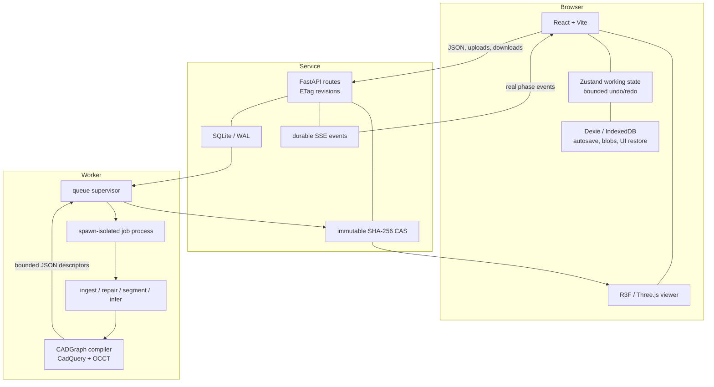

# Architecture

Mesh2Param is a local-first browser workspace backed by an authoritative service and an exact
server-side geometry kernel. The separation is intentional: Three.js displays signed tessellated
artifacts, while only CadQuery/Open CASCADE builds and validates solids.

## Components



| Layer | Source | Responsibility |
| --- | --- | --- |
| Contracts | `packages/contracts` | One CADGraph JSON Schema, Pydantic models, generated TypeScript types, invariant validation, migration, canonical JSON |
| Engine | `engine/mesh2param` | Untrusted mesh parsing, diagnostics, explicit repair, fitting, segmentation, evidence, bounded candidates, exact compilation, validation, artifacts |
| API | `services/api/mesh2param_api` | Project/revision authority, upload preflight, job orchestration, artifact/version APIs, SSE, health/readiness |
| Web | `apps/web` | Seven-step interaction, signed artifact display, editing, local recovery, save/open, accessible responsive shell |
| UI | `packages/ui` | Shared tokens and compact typed controls |

## Authority and consistency

The backend owns project revisions, jobs, versions, and artifact sets. Every mutating project request
uses an `If-Match: "rev-N"` precondition. A stale revision fails; it is never silently merged.

The browser maintains one working document and a bounded project-edit history. IndexedDB
`mesh2param-workspace` mirrors metadata, document, versions, verified blobs, UI state, history, and
an outbox. Autosave/reload recovery is not a second server authority. When local and server state
diverge, geometry operations remain blocked until the conflict is resolved without discarding either
side.

## Geometry data flow

1. Upload preflight streams and structurally validates STL/OBJ/PLY under byte/count/coordinate caps.
2. Original bytes are published unchanged to the CAS; analysis reads a normalized working copy.
3. Repair operations produce a new version plus before/after metrics; no operation is implicit.
4. Segmentation creates evidence-linked analytic patches and a GLB-hash-bound triangle selection map.
5. Reconstruction proposes a bounded set of CADGraphs, compiles each through OCCT, rejects invalid
   solids, compares valid results, and keeps compact alternatives.
6. Validation compiles the selected CADGraph, validates the B-Rep, exports STEP, independently
   reimports and validates it, tessellates, and compares with the source.
7. The service publishes immutable content-addressed artifacts and a manifest. The browser renders
   those artifacts; it does not infer validity from appearance.

### Analytic prismatic reconstruction

Before a `freeform` side remainder rejects the older L-bracket inference path, the engine tests the
mesh as a possible linear extrusion. It finds significant antipodal planar caps, refines the
translation axis from the minimum eigenvector of the area-weighted side-normal covariance, checks
the axial extents, and matches ordered projected cap loops under cyclic shift and reversed winding.
Open or branching cap boundaries, mismatched caps, non-perpendicular side normals, degenerate
length, and self-intersecting profiles all produce structured rejection diagnostics.

An accepted cap loop is projected into a deterministic orthonormal sketch frame and globally
segmented with a cached dynamic program. Candidate intervals are total-least-squares lines or
endpoint-constrained circular arcs; the objective combines normalized residuals with primitive and
breakpoint penalties. Adjacent entities share exact coordinates and record their tangent gap. The
resulting CADGraph contains ordered `line` and `circularArc` entities, a `closedProfile`, and one
extrusion on the measured arbitrary plane. The compiler creates one analytic wire and face and
extrudes it through OCCT, so arc edges produce cylindrical side faces and line edges produce planar
ones. B-Rep validity, bidirectional source comparison, bounding box and volume agreement, STEP
export, and independent STEP reimport remain acceptance gates.

The principal prismatic tolerances are separate and configurable: cap angle/area/loop matching,
side-normal RMS and accepted-area fraction, line and arc RMS/maximum residual, minimum primitive
length, minimum arc sweep and sagitta, scale-relative maximum radius, and primitive/breakpoint
penalties. The segmentation threshold for a complete cylinder remains high (300 degrees by
default). A partial profile arc needs only its own sweep and sagitta evidence; lowering full-cylinder
coverage to admit a 2-D fillet would conflate two different geometric claims.

## Jobs and process isolation

Development defaults to `job_runner_mode=embedded`: the API owns the local supervisor. Production
uses `external`: the API never claims jobs, and one standalone worker runs:

```sh
python -P -m mesh2param_api.jobs.service run
```

SQLite external mode deliberately permits one worker. API and worker share the entire absolute
`MESH2PARAM_DATA_DIR`, which contains the database, storage, work directories, worker heartbeat, and
singleton advisory lock. Each geometry attempt still executes in a new spawned child with a private
working directory, bounded JSON IPC, resource limits, timeout, cancellation, and cleanup.

`/health` is API liveness. `/ready` additionally proves database/storage readiness and, in external
mode, a fresh worker heartbeat. This distinction prevents a live API from advertising unavailable
geometry capacity.

## Storage and artifacts

SQLite runs in WAL mode for project/job metadata. Binary source and output content uses a local
SHA-256 CAS with randomized staging, verified digest, atomic publication, no-follow reads, and
deduplication. Artifact sets reference immutable blobs and inherit unchanged prior outputs. A
version is an immutable project-state snapshot; restoring creates a new working copy rather than
mutating history.

The default implementation is intentionally SQLite plus local filesystem storage. PostgreSQL,
S3-compatible storage, and Redis-compatible queues are interface-only future work and are rejected
when configured, rather than silently ignored.

## Trust boundaries

- Uploaded bytes, filenames, project files, CADGraphs, and generated artifacts are untrusted data.
- Generated `.cq.py` is a deterministic export artifact and is never executed by the service.
- Worker operation selection is a static trusted map; user-controlled imports, paths, shell, eval,
  exec, subprocess, and dynamic installation are prohibited.
- Browser artifact selection is accepted only when its selection-map hash matches the displayed GLB.
- Production defense requires container/host egress denial in addition to Python audit hooks.

See [security](security.md), [validation](validation.md), and [deployment](deployment.md).
