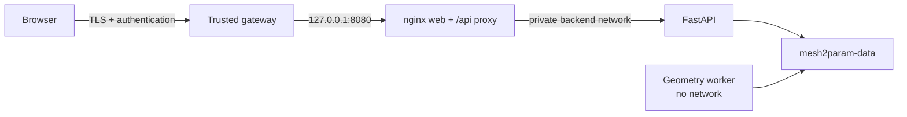

# Deployment and operations

The supported production topology is a same-origin web proxy, one FastAPI process, and one external
geometry worker. The API and worker share one absolute data volume containing SQLite, content-
addressed artifacts, job work areas, a worker heartbeat, and a singleton worker lock.



Mesh2Param itself has no login or tenant authorization. The gateway shown above is mandatory for
remote access. For local-only use, Compose publishes the web service on loopback and no gateway is
required.

## Cloudflare Worker frontend

The repository includes a Cloudflare Worker entrypoint and `wrangler.jsonc`. It deploys the Vite
build through Workers Static Assets with SPA fallback routing. The production UI is browser-first:

- IndexedDB is the project, revision, source, version, and artifact store.
- A dedicated browser Web Worker loads `occt-wasm` and compiles supported CADGraph operations.
- The bounded parametric path performs mesh normalization, section extraction, SVD-based B-spline
  fitting, semantic edge resolution, fillet/detail reconstruction, bidirectional BVH comparison,
  STEP export, and STEP reimport entirely inside that Web Worker.
- Exact validation checks the OCCT B-Rep, exports STEP, reimports it, and checks the result.
- Bundled samples and their source/reference artifacts are static same-origin assets.
- Generated STEP/GLB/CADGraph artifacts are Blob URLs and survive reload through IndexedDB.

Cloudflare does not execute the 22 MB WASM module in a request handler; it only serves it to the
browser. This keeps Worker CPU/memory limits out of geometry execution. `pnpm cf:assets` fails the
build if any generated asset exceeds Cloudflare's 25 MiB per-file limit. The document CSP remains
free of `unsafe-eval`.
Emscripten Embind requires dynamic invoker generation, so that permission is narrowly overridden
only on the hashed `geometry.worker-*` response.

The Python service is not bundled into the Worker. The proven general-parametric spanner family no
longer needs it: browser-local mode supports the sharp, filleted, and filleted-plus-shallow-boss
fixtures, including functional suppression and full detail recovery. Arbitrary topology, full
repair and segmentation, process isolation, and shared multi-user persistence still require the
self-hosted FastAPI/CadQuery/OCCT topology below. Browser-local mode fails at a named evidence stage
for unsupported paths instead of exporting a faceted result as parametric.

Install and validate the deployment without publishing it:

```sh
pnpm install --frozen-lockfile
pnpm cf:check
```

Run the complete browser-local Worker app locally:

```sh
pnpm cf:dev
```

In another terminal, verify sample loading, IndexedDB reload, the worker-only CSP exception, OCCT
WASM compilation, B-Rep/STEP validation, and artifact rendering:

```sh
pnpm cf:test
```

Deploy the self-contained browser-local Worker:

```sh
pnpm cf:deploy
```

For large or highly faceted meshes, enable the same-origin API proxy to an explicitly self-hosted
backend:

```sh
pnpm cf:deploy --var MESH2PARAM_API_ORIGIN:https://api.example.com
```

`MESH2PARAM_API_ORIGIN` must be a bare `http://` or `https://` origin with no credentials, path,
query, or fragment. Use HTTPS outside local development. Wrangler's `--var` value is deployment
configuration, not a secret; the API origin is visible to operators and need not contain
credentials.

At startup the web client probes the same-origin `/ready` route. A ready response selects the
FastAPI/OCCT backend for the whole workspace; a missing or unavailable origin keeps the project in
browser-local mode. Browser-local analysis parses STL triangles directly and avoids an OCCT
retessellation round-trip. Its curved converter is intentionally bounded to watertight,
axis-aligned layered solids: it fits swept or smooth-loft surfaces, preserves corroborated holes,
and rejects results outside its volume/bounds safety gates. Native conversion is recommended for
arbitrary topology because sewing, STEP export, and STEP reimport are memory- and CPU-intensive.
The default native job timeout is 300 seconds; size the API/worker host for the configured 4 GiB
worker memory limit and raise the timeout deliberately when production models require it.

For a browser-visible Worker origin such as `https://cad.example.com` and an API origin such as
`https://api.example.com`, the backend must use exact production values that include:

```dotenv
MESH2PARAM_PUBLIC_URL=https://api.example.com
MESH2PARAM_ALLOWED_HOSTS=api.example.com
MESH2PARAM_CORS_ORIGINS=https://cad.example.com
```

Browser-local data is isolated to a browser profile and is not shared across devices. Protect a
server-connected deployment with a trusted authentication gateway such as Cloudflare Access, and
prevent the API origin from being used as an unauthenticated bypass. The optional backend must
remain paired with exactly one external geometry worker and their shared persistent volume.

The production build registers a same-origin service worker. After the app shell and geometry
worker have been used once, their hashed JavaScript, WASM, fonts, and sample assets are cached for a
later offline session. Source meshes and generated STEP/GLB/CADGraph artifacts remain in IndexedDB;
the service worker never caches `/api/*`. Clearing site data removes both caches and local projects.

## Compose quickstart

Prerequisites are Docker Engine or Docker Desktop with Compose v2 and sufficient resources for the
OCCT worker.

```sh
cp .env.example .env
docker compose config
docker compose up --build
```

`.env` is consumed by Docker Compose for interpolation. The application processes intentionally do
not auto-load dotenv files; Compose passes an explicit allowlisted environment to each container.
This keeps the production external-worker profile from leaking into a later `pnpm dev` session.

Open `http://localhost:8080`. The default published address is
`127.0.0.1:${COMPOSE_WEB_PORT:-8080}`; neither the API nor worker has a host port. Stop without
deleting data using `docker compose down`. Do not add `--volumes` unless permanent data deletion is
intended and backed up.

The backend image build performs a real OCCT STEP export/reimport and B-Rep validation smoke test.
Both runtime images include the project and third-party license bundle under
`/usr/share/doc/mesh2param`; the web image also serves it at `/legal/`.

## Service contract

| Service | Command and responsibility | Health contract |
| --- | --- | --- |
| `web` | nginx static UI and same-origin reverse proxy on port 8080 | `GET /ready` through the API |
| `api` | `python -P -m mesh2param_api.cli`; HTTP authority and durable queue producer | `GET /health` is liveness only |
| `worker` | `python -P -m mesh2param_api.jobs.service run`; owns geometry execution | heartbeat age via `healthcheck --max-age 15` |

The backend image is pinned to `linux/amd64` because the locked CPython 3.12 `nlopt` dependency has
no Linux ARM wheel. The web image remains native-platform. ARM hosts therefore require standard
amd64 container emulation; the acceptance workflow is configured to exercise this path.

`GET /ready` returns `200` only when SQLite, filesystem storage, and the configured job runner are
ready. In external mode it requires a fresh `<data-dir>/worker-heartbeat.json`; otherwise it returns
`503`. The singleton lock is `<data-dir>/worker.lock`. API and worker must use the identical absolute
`MESH2PARAM_DATA_DIR`, database URL, and storage path.

## Required production configuration

The supplied Compose file sets these security-critical values:

```text
MESH2PARAM_ENVIRONMENT=production
MESH2PARAM_DATA_DIR=/var/lib/mesh2param
MESH2PARAM_DATABASE_URL=sqlite:////var/lib/mesh2param/db/mesh2param.sqlite3
MESH2PARAM_STORAGE_PATH=/var/lib/mesh2param/storage
MESH2PARAM_JOB_RUNNER_MODE=external
MESH2PARAM_WORKER_COUNT=1
MESH2PARAM_DEBUG=false
```

The `.env.example` file documents the supported bounds. Important operator settings include:

| Setting | Compose default | Meaning |
| --- | --- | --- |
| `MESH2PARAM_PUBLIC_URL` | `http://localhost:8080` | Exact browser-visible origin |
| `MESH2PARAM_API_URL` | `http://api:8000` | Internal proxy target, not the public API URL |
| `MESH2PARAM_ALLOWED_HOSTS` | `localhost,127.0.0.1` | Exact accepted HTTP hostnames |
| `MESH2PARAM_CORS_ORIGINS` | Both local loopback origins on port `8080` | Exact allowed browser mutation origins |
| `MESH2PARAM_MAX_UPLOAD_MB` | `100` | nginx and API upload cap |
| `MESH2PARAM_MAX_TRIANGLES` | `2000000` | Parsed-mesh triangle cap |
| `MESH2PARAM_MAX_VERTICES` | `6000000` | Parsed-mesh vertex cap |
| `MESH2PARAM_JOB_TIMEOUT_SECONDS` | `900` | Geometry job wall-clock limit |
| `MESH2PARAM_WORKER_MEMORY_MB` | `1024` | Worker child address-space target on supported Linux hosts |
| `MESH2PARAM_RETENTION_DAYS` | `30` | Minimum age before unreferenced blob cleanup at startup |

Compose-only `COMPOSE_API_CPUS`, `COMPOSE_API_MEMORY`, `COMPOSE_WORKER_CPUS`,
`COMPOSE_WORKER_MEMORY`, `COMPOSE_WEB_CPUS`, `COMPOSE_WEB_MEMORY`, `COMPOSE_WEB_PORT`, and
`COMPOSE_IMAGE_TAG` tune container resources or naming. They are intentionally not
`MESH2PARAM_*` settings.
When changing `COMPOSE_WEB_PORT`, set `MESH2PARAM_PUBLIC_URL` and
`MESH2PARAM_CORS_ORIGINS` to the same browser-visible port; mismatched origins fail closed.

Production settings reject unknown `MESH2PARAM_*` names and unsupported S3, Redis, PostgreSQL,
multi-worker SQLite, relative-path, symlink-path, wildcard host/origin, and debug configurations.
This is intentional fail-closed behavior. The only implemented persistent topology in this release
is SQLite plus filesystem CAS with one external worker.

## Remote TLS/authentication gateway

Keep the Compose port bound to `127.0.0.1`, route a trusted TLS/authentication gateway to that port,
and set values matching the public origin. For `https://cad.example.com`:

```dotenv
MESH2PARAM_PUBLIC_URL=https://cad.example.com
MESH2PARAM_ALLOWED_HOSTS=cad.example.com
MESH2PARAM_CORS_ORIGINS=https://cad.example.com
MESH2PARAM_API_URL=http://api:8000
```

The gateway must set `Host` to the configured public hostname, enforce request size/time limits
compatible with Mesh2Param, and avoid buffering the upload and SSE paths in a way that defeats
streaming. The bundled nginx-to-API hop deliberately uses its own internal HTTP scheme and the API
does not trust cross-container forwarding headers. The TLS gateway is therefore authoritative for
HTTPS redirects, HSTS, and client-address logging; do not rely on application HSTS in this two-hop
topology. It must authenticate all application paths, including `/api`, `/openapi.json`, `/health`,
`/ready`, and `/legal` if those must not be public. Do not publish port 8000 or attach the worker to a
network.

## Persistence, backup, and restore

The named `mesh2param-data` volume is the complete authoritative server state. Browser IndexedDB is
only a recovery mirror and downloads are not a database backup.

For a consistent offline backup:

1. Stop the stack with `docker compose down` (without `--volumes`).
2. Snapshot or archive the entire named volume, preserving file ownership, modes, and all paths.
3. Record the application image tag/commit and `.env` settings separately; do not include secrets in
   source control.
4. Restart and require `GET /ready` to return `200`.

Restore into an empty volume with the matching application version, restore the complete snapshot,
start API and worker, and verify readiness plus an existing project's artifact hashes before
accepting traffic. Test the procedure regularly. Copying only the SQLite file or only storage can
leave references and content-addressed blobs inconsistent.

## Upgrades and rollback

Before upgrading, run repository verification, build both images, back up the data volume, and keep
the previous image tag. API and worker apply database migrations on startup; deploy the matching API
and worker image together. After start, verify `/health`, then `/ready`, create/rebuild a disposable
project, validate STEP reimport, and inspect logs for recovery or migration failures.

Application rollback is safe only when the previous version understands the migrated schema. If it
does not, stop the stack and restore the pre-upgrade volume snapshot together with the prior images.
Never point two independent workers or mixed application versions at the same SQLite data volume.

## Monitoring and routine operations

Monitor:

- `/ready` status and its `database`, `storage`, `supervisor`, and `runnerMode` fields;
- API/worker restarts, stale heartbeat events, job timeouts/crashes/cancellations, and queue age;
- volume capacity/inodes and the age/size of backups;
- reverse-proxy rejection/authentication events and application audit records; and
- CPU, memory, PID, and temporary-filesystem pressure against Compose limits.

Logs go to stdout/stderr. Use `INFO` or stricter in production; `DEBUG` is rejected. Request IDs and
persisted audit rows support correlation, but operators remain responsible for log collection,
access control, rotation, and retention.

## Troubleshooting

- **`/health` is 200 but `/ready` is 503:** inspect the response fields, then check volume
  permissions, SQLite/storage availability, the worker container, and heartbeat freshness.
- **Worker exits immediately:** confirm external runner mode, exactly one worker, one shared absolute
  data root, and no competing process holding `worker.lock`.
- **Browser mutations are rejected:** make public URL, CORS origin, allowed host, gateway Host, and
  browser origin agree exactly, including scheme and port.
- **Web container rejects startup:** `MESH2PARAM_API_URL` must be an internal
  `http://host:port` URL and upload MB must be decimal `1..1024`.
- **Production settings fail validation:** remove unknown/unsupported variables; do not bypass the
  rejection by switching to development mode.
- **Build fails at the STEP smoke:** treat the image as unusable; inspect the pinned CadQuery/OCP
  runtime instead of deleting the smoke gate.
- **Artifacts consume disk after deletion:** cleanup covers only unreferenced blobs older than the
  retention period and runs at startup; verify references and backups before manual intervention.

See the [security model](security.md) before changing networks, privileges, paths, or public exposure.
