# Validation methodology

Mesh2Param separates schema validity, kernel validity, STEP roundtrip validity, and geometric fit.
No single green-looking mesh or UI state substitutes for the complete chain.

## Required chain

```mermaid
flowchart LR
  G["CADGraph schema + invariants"] --> C["feature-by-feature OCCT compile"]
  C --> B["single closed positive-volume B-Rep"]
  B --> E["STEP export"]
  E --> I["independent STEP reimport"]
  I --> R["reimport BRepCheck + topology/volume"]
  R --> T["tessellation"]
  T --> M["bidirectional source comparison"]
  M --> P["persist hashes, versions, status"]
```

1. Validate and migrate the CADGraph; reject unknown fields, dangling references, invalid order,
   non-finite values, and operation-specific invariant failures.
2. Compile features in order. Each intermediate shape must pass CadQuery validity and OCCT
   `BRepCheck_Analyzer`; failure retains the last valid feature result.
3. Require exactly one solid, closed bounding shells, positive finite volume, and non-empty
   tessellation.
4. Export STEP only from that valid source shape. Normalize process/time-only header fields for
   deterministic bytes without changing geometry, then hash the file.
5. Reimport the written `.step`/`.stp` through CadQuery/OCCT as a new shape.
6. Repeat single-solid, closure, B-Rep, volume, area/topology, and tessellation checks on the
   reimport. Compare source/reimport volume within the configured numerical tolerance and require
   topology counts to match.
7. Compare the validated result against the preserved source mesh and evaluate the user project
   tolerance.

If export, reimport, or any reimport check fails, the service does not publish a successful STEP
validation claim.

## Status model

Per-version validation states include: `not-run`, `running`, `valid`, `valid-with-warnings`,
`invalid-brep`, `step-export-failed`, `step-reimport-failed`, and `outside-tolerance`. The detailed
record separately stores B-Rep validity, STEP reimport validity, tolerance satisfaction, issues, and
compilation/export evidence.

Kernel-valid and tolerance-valid are distinct. A valid exact solid can still be outside the source
tolerance; a close tessellated result can never make an invalid solid acceptable.

## Comparison evidence

The reconstruction comparison records bidirectional/symmetric surface distance summaries (RMS,
median, P95, P99, and maximum where available), normal agreement, bounding-box, surface area, volume
difference, overlap, unmatched-source and excess-result evidence, per-patch residuals, and score.
A residual heatmap GLB visualizes the spatial error without changing the source or CADGraph.

Tolerance is stored in project units and passed explicitly to validation. Changing it updates the
CADGraph project tolerance and recomputes pass/fail; it does not rewrite measured geometry or make a
previous result disappear.

The general-parametric path applies the same chain to each bounded candidate. A spline-aware sharp
parent must compile before a constant-radius fillet candidate can reference its resolved semantic
rim edges. The sharp parent is retained in `candidates.json` with its measured band mismatch; the
filleted candidate is accepted only when P95 is at most `1.5t`, P99 at most `3t`, maximum distance
at most `6t`, P95 normal error at most 3 degrees, and relative volume error at most 0.1 percent.
Fillet candidates may introduce kernel-generated torus and B-spline faces, but the reimport audit
still rejects unclassified surfaces and triangle-per-face output.

Functional detail suppression never changes the preserved source mesh. Material beyond a primary
cap plane is eligible only when it forms a bounded, closed, constant-depth footprint within the
configured depth, cap-area, volume, region-count, and triangle-count limits. The
`suppressed-regions.json` artifact records the support plane, complete boundary loop, source
triangle IDs, exposed area, depth, and measured volume. Every vertex of every suppressed triangle
must project inside that declared footprint.

Validation then compares the result twice: unmasked against the complete source (so the omitted
detail remains visible in metrics and the residual heatmap), and masked against a watertight
functional reference that replaces exactly the declared detail with its support face. Only the
masked metrics determine functional-mode acceptance; both reports are persisted together in
`comparison.json`, and the CADGraph snapshot records `validationMode: functional` plus the same
suppressed-region declarations.

## Artifacts and reproducibility

Successful validation persists:

- the exact CADGraph snapshot and source SHA-256;
- source and reimport validation structures;
- normalized STEP bytes and SHA-256;
- engine/schema/dependency versions and deterministic seed;
- comparison settings, metrics, and residual artifact hashes;
- project/model/parent version identity and timestamp.

The export manifest binds these records to the artifact set. Re-run validation after any CADGraph,
unit, tolerance, engine, dependency, or source change; do not carry a prior success label onto new
inputs.

## Acceptance evidence

The core geometry acceptance generates the L-bracket from its own CADGraph, exports exact STEP,
tessellates and randomly transforms the source, reconstructs it, validates B-Rep and STEP reimport,
compares it, edits a major dimension by +10%, rebuilds, restores the value, rebuilds, and confirms
metrics return close to the original. Deterministic sample generation and unit tests cover every
supported compiler operation separately.

## Claim boundary

Mesh2Param proves that the selected graph builds a valid solid and that its geometry is equivalent
within measured tolerance. It does not prove that the inferred feature order, sketches, dimensions,
constraints, names, or design intent match those used by the source designer.
